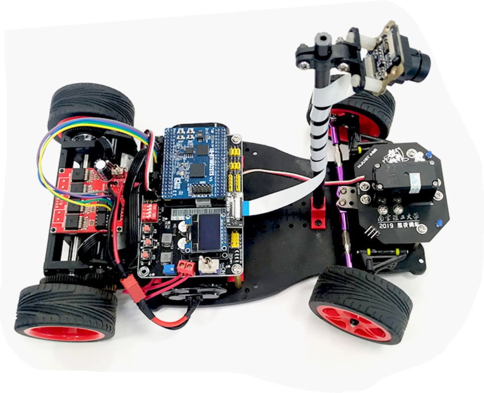

<!-- README的大标题 -->
 

  

  <h3 align="center">会自己沿着路跑的小车</h3>

  

    第14届全国大学生智能汽车竞赛的作品
	 
	完成度80%，从硬件开始往上做，专注于轮子打造
     
	真·闭门造车
  

----

## 硬件介绍

- 内核：ARM Crotex-M7
- 芯片系列：NXP i.MX RT系列
- 芯片型号：RT1052 CVL5B
- 开发核心板：LQ-RT1052SYS-VS
- 摄像头型号：MT9V034

（原理图PCB还没放上来。）

## 软件介绍

- 开发环境：IAR Embedded Workbench 8.0

（工程结构还没写）

## 免责声明

代码遵循GNU General Public License v3.0开源许可
请务必遵循GPL-3.0许可证协议进行代码的使用和修改

第十四届智能车NJUST的四轮组。代码仅用于学习交流目的，不保证运行的可靠性。

GPL协议的几个原则：

	1.确保软件自始至终都以开放源代码形式发布。
	
	2.你可以去掉所有原作的版权信息，只要你保持开源，并且随源代码附上 GPL 的许可证就行。
	
	3.不允许修改后和衍生的代码做为闭源的商业软件发布和销售。

   #####   GPL协议的核心思想：思想共享，源代码共享